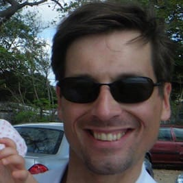

# Tapanilan Erä - miekkailujaosto

Olet Tapanilan Erän miekkailujaoston kotisivuilla. Keskitymme nuoriso- ja kilpailutoimintaan Pohjois-Helsingissä Tapanilan Urheilukeskuksessa (Erätie 3, 00700 HKI), aseina sekä kalpa että säilä.

Jäsenemme ovat tasoltaan kuntoilijoista maailmalla mainetta niittäneisiin kilpaurheilijoihin. Eri tasoiset ja ikäiset harjoittelevat yhdessä, minkä ansiosta ilmapiiri harjoituksissa on avoin. Ota yhteyttä sihteeriimme tai tule tutustumaan harjoituksiin.

Harjoitukset on keskiviikkoisin ja perjantaisin:

* 18.00-19.15: Nuoret
* 19.15-20.30: Vanhemmat juniorit ja aikuiset

## Alkeiskurssit

Seuraavat alkeiskurssi alkaa keskiviikkona 13.1.2016 ja kestää 4 viikkoa. Kurssin jälkeen uudet miekkailijat liittyvät mukaan samanikäisten ryhmään. Harjoitusajat pysyvät koko kevään samoina, keskiviikkoisin ja perjantaisin: 

* 18.00-19.15: 10-15v tytöt ja pojat
* 19.15-20.30: Yli 16v miehet ja naiset

Alkeiskurssin hinta on nuorilta 140€ ja aikuisilta 180€. Kurssille tarvitset mukaan normaalit sisäliikuntavarusteet, miekkailuvarusteiden laina kuuluu kurssin hintaan. Alkeiskurssin käyneille loppukausi (kevät 2016) on ilmainen!

Ilmoittautumiset ja lisätiedot Samuli Korpimäki, sähköpostitse [tapera.miekkailujaosto@gmail.com](mailto:tapera.miekkailujaosto@gmail.com) tai puh 044 568 0781.

## Valmentajat

    
    <h3>Petri Vammelvuo</h3>

Maître d’armes ja Maestro di scherma Petri Vammelvuo on miekkailujaoston päävalmentaja. Hän ohjaa erän opetusta ja valmentaa sekä kalvalla että säilällä.
<a href="petri/">Lue lisää >></a>

    
    <h3>Samuli Korpimäki</h3>

Samuli on säilän vastuuvalmentaja ja opettaa sekä nuoria että aikuisia säilistejä.

    
    <h3>Olli Mahlamäki</h3>

Olli on säilämiekkailun 8-kertainen suomenmestari. Hän kilpailee edelleen itse ja valmentaa nuorten ryhmää. Lisäksi Olli on miekkailujaoston puheenjohtaja.

    
    <h3>Timo Sarpola</h3>

Timo on miekkailujaoston aktiiveista pisimpään mukana ollut jäsen. Hän kilpailee itse kalvalla ja säilällä ja valmentaa nuorten kalparyhmää.

## Yritys-, kaveri- ja polttariryhmät

Jos haluat elävöittää polttari-, virkistyspäivää tms. miekkailulla, ota yhteyttä [tapera.miekkailujaosto@gmail.com](mailto:tapera.miekkailujaosto@gmail.com). Miekkailuun tutustumisen hinta on 300€ (alv 0%) 1-10 hengelle. Tutustuminen kestää 1,5 tuntia, jonka aikana opetellaan jalkatyötä, lyöntejä ja väistöjä - riittävästi perusasioita, jotta jokainen pystyy turvallisesti ottamaan vähintään yhden ottelun kaveria vastaan. Kaikki miekkailuvarusteet kuuluvat hintaan, mukaan tarvitset vain:

- Sisäliikuntavarusteet
    + Vähintään polvipituiset housut
    + Sisäliikuntakengät
- Juomapullon, täällä tulee hiki
