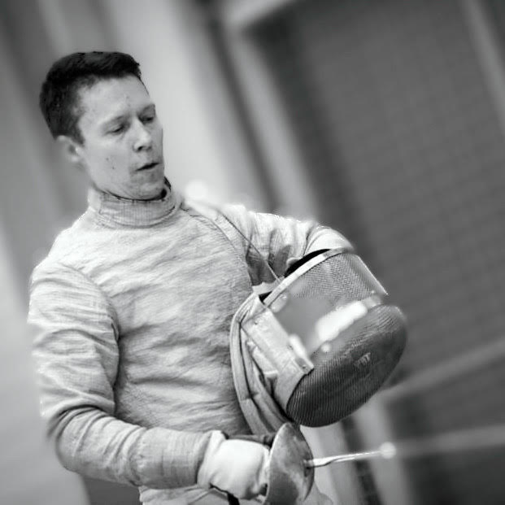
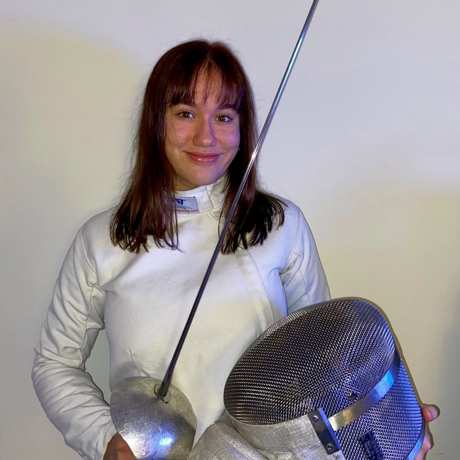

# Tapanilan Erä - miekkailujaosto

Olet Tapanilan Erän miekkailujaoston kotisivuilla. Keskitymme nuoriso- ja kilpailutoimintaan Pohjois-Helsingissä Tapanilan Urheilukeskuksessa (Erätie 3, 00700 HKI), aseena meillä on säilä.

Jäsenemme ovat tasoltaan kuntoilijoista maailmalla mainetta niittäneisiin kilpaurheilijoihin. Eri tasoiset ja ikäiset harjoittelevat yhdessä, minkä ansiosta ilmapiiri harjoituksissa on avoin.

Harjoitukset on maanantaisin, keskiviikkoisin ja perjantaisin:

- Maanantai 18.00-19.00: Minijuniorit
- Maanantai 19.00-21.00: Kilparyhmä ja aikuiset
- Keskiviikko 18.00-19.30: Nuoret
- Keskiviikko 19.30-21.00: Vanhemmat juniorit ja aikuiset
- Perjantai 18.00-19.30: Nuoret
- Perjantai 19.30-21.00: Vanhemmat juniorit ja aikuiset

## Alkeiskurssit

Seuraavat alkeiskurssit alkavat 8.1.2024 (minijuniorit) ja 10.1.2024 (nuoret ja aikuiset). Osallistujat valitaan ilmoittautumisjärjestyksessä, joten toimi nopeasti!

Minijuniori-kurssi 8-9v tytöille ja pojille pidetään maanantaisin klo 18-19. Kerran viikossa koko kevään jatkuva kurssi maksaa 100€.

Nuorten ja aikuisten alkeiskurssilla pidetään kahdet harjoitukset viikossa keskiviikkoisin ja perjantaisin:

- 18.00-19.30: 10-15v tytöt ja pojat
- 19.30-21.00: Yli 16v miehet ja naiset

Alkeiskurssin hinta on nuorilta 200€ ja aikuisilta 240€. Kurssille tarvitset mukaan sisäliikuntavarusteet, miekkailuvarusteiden laina kuuluu kurssin hintaan. Alkeiskurssimaksuun sisältyy kausimaksu, eli kurssiosuuden päätyttyä treenit jatkuvat samaan aikaan samassa paikassa ilman lisämaksua joulukuun loppuun! Aikuisten alkeiskurssimaksun voi suorittaa myös liikuntaseteleillä / -kortilla. Alkeiskurssimaksun lisäksi laskutetaan koko Tapanilan Erän jäsenmaksu, jonka määrä päätetään pian (vuonna 2023 maksu oli 5€/vuosi)

Lisätiedot Olli Mahlamäki, sähköpostitse [tapera.miekkailujaosto@gmail.com](mailto:tapera.miekkailujaosto@gmail.com) tai puh 044 320 4841.

Ilmoittautumiseen tarvittavat tiedot:

- Nimi
- Syntymäaika
- Osoite
- Sähköposti
- Puhelinnumero (oma ja huoltajan)

<a href="https://forms.gle/ASgjptjtKb7Tru9F7" class="register-button" role="button" target="_blank">Ilmoittaudu nyt!</a>

## Jatko alkeiskurssin jälkeen

Alkeiskurssin jälkeen kaikki miekkailijat siirtyvät automaattisesti jatkoryhmään. Erillistä ilmoittautumista seuraavalle kaudelle ei tarvita, vaan kaikki jatkavat
samanikäisten ryhmässä. Harjoitusajat ovat alkeiskurssilla ja jatkoryhmässä täsmälleen samat, jotta harjoittelun jatkaminen olisi mahdollisimman helppoa.

Ensimmäisen vuoden ajan saa jatkaa seuran varusteiden käyttöä. Kun miekkailun aloituksesta on kulunut vuosi, pitää hankkia omat varusteet, ohjeet löytyvä
<a href="omat-varusteet/">omat varusteet</a> osioista.

## Valmentajat

    
    <h3>Samuli Korpimäki</h3>

Samuli on Erän päävalmentaja. Hän opettaa sekä nuoria että aikuisia säilistejä. Keväällä 2022 Samuli kävi FIE:n 3kk kestävän valmentajakoulutuksen Unkarissa, eli hän
on yksi parhaiten koulutetuista säilävalmentajista Suomessa. SM5L valitsi hänet vuoden 2022 miekkailuvalmentajaksi.

    
    <h3>Olli Mahlamäki</h3>

Olli on säilämiekkailun 11-kertainen suomenmestari. Hän kilpailee edelleen itse ja valmentaa kilparyhmää sekä minijunioreja. Lisäksi Olli on miekkailujaoston puheenjohtaja.

    
    <h3>Tommi Högman</h3>

Tommi on Erän oma kasvatti, joka valmentaa nuorten ryhmää ja miekkailee itse aikuisten ryhmässä.

    
    <h3>Sara Salminen</h3>

Sara on voittanut säilän suomenmestaruuden U17, U20 (2 kertaa) ja naisten sarjassa. Hän kilpailee itse ja valmentaa kilparyhmää.

## Tietoa miekkailusta

    <iframe src="https://www.youtube.com/embed/nFLRsasWPwo" frameborder="0" allow="accelerometer; autoplay; encrypted-media; gyroscope; picture-in-picture fullscreen" allowfullscreen></iframe>

## Yritys-, kaveri- ja polttariryhmät

Jos haluat elävöittää polttari-, virkistyspäivää tms. miekkailulla, ota yhteyttä [tapera.miekkailujaosto@gmail.com](mailto:tapera.miekkailujaosto@gmail.com). Miekkailuun tutustumisen hinta on 300€ (alv 0%) 1-10 hengelle. Tutustuminen kestää 1,5 tuntia, jonka aikana opetellaan jalkatyötä, lyöntejä ja väistöjä - riittävästi perusasioita, jotta jokainen pystyy turvallisesti ottamaan vähintään yhden ottelun kaveria vastaan. Kaikki miekkailuvarusteet kuuluvat hintaan, mukaan tarvitset vain:

- Sisäliikuntavarusteet
  - Vähintään polvipituiset housut
  - Sisäliikuntakengät
- Juomapullon, täällä tulee hiki

## Seuraa meitä Facebookissa

<blockquote cite="https://www.facebook.com/eramiekkailu"><a href="https://www.facebook.com/eramiekkailu">Tapanilan Erän Miekkailujaosto</a></blockquote>

