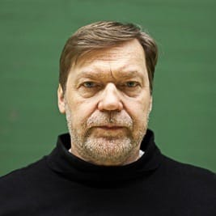

# Tapanilan Erä - miekkailujaosto

Olet Tapanilan Erän miekkailujaoston kotisivuilla. Keskitymme nuoriso- ja kilpailutoimintaan Pohjois-Helsingissä Tapanilan Urheilukeskuksessa (Erätie 3, 00700 HKI), aseina sekä kalpa että säilä.

Jäsenemme ovat tasoltaan kuntoilijoista maailmalla mainetta niittäneisiin kilpaurheilijoihin. Eri tasoiset ja ikäiset harjoittelevat yhdessä, minkä ansiosta ilmapiiri harjoituksissa on avoin.

Harjoitukset on maanantaisin, keskiviikkoisin ja perjantaisin:
* Maanantai 18.00-19.00: Minijuniorit
* Maanantai 19.00-21.00: Kilparyhmä, kalpa ja aikuiset
* Keskiviikko 18.00-19.15: Nuoret
* Keskiviikko 19.15-20.30: Vanhemmat juniorit ja aikuiset
* Perjantai 18.00-19.15: Nuoret
* Perjantai 19.15-20.30: Vanhemmat juniorit ja aikuiset

## Alkeiskurssit

Syksy alkeiskurssit alkaa maanantaina 31.8.2020 ja keskiviikkona 2.9.2020. Osallistujat valitaan ilmoittautumisjärjestyksessä, joten toimi nopeasti!

**Uutuus** Minijuniori-kurssi 8-9v tytöille ja pojille maanantaisin klo 18-19. Nyt myös perheen pienemmät pääsevät mukaan miekkailuun. Kerran viikossa koko syksyn jatkuva kurssi maksaa 100€. 

Nuorten ja aikuisten ryhmät harjoittelevat samaan aikaan pidempään harrastaneiden kanssa, joten kurssilta jatko on helppoa. Harjoitukset on 2 kertaa viikossa keskiviikkoisin ja perjantaisin: 

* 18.00-19.15: 10-15v tytöt ja pojat
* 19.15-20.30: Yli 16v miehet ja naiset

Alkeiskurssin hinta on nuorilta 200€ ja aikuisilta 240€. Kurssille tarvitset mukaan sisäliikuntavarusteet, miekkailuvarusteiden laina kuuluu kurssin hintaan. Alkeiskurssin käyneille loppukausi (syksy 2020) on ilmainen! Aikuisten alkeiskurssimaksun voi suorittaa myös liikuntaseteleillä / -kortilla.

Lisätiedot Olli Mahlamäki, sähköpostitse [tapera.miekkailujaosto@gmail.com](mailto:tapera.miekkailujaosto@gmail.com) tai puh 044 320 4841.

Ilmoittautumiseen tarvittavat tiedot:

* Nimi
* Syntymäaika
* Osoite
* Sähköposti
* Puhelinnumero (oma ja huoltajan)

<a href="https://forms.gle/P8WLSvN1AaJVe7XG6" class="register-button" role="button">Ilmoittaudu nyt!</a>

## Turvallisuus ja COVID-19

Miekkailujaosto noudattaa Suomen Miekkailu- ja 5-otteluliiton ja Tapanilan Erän ohjeita, jotta harjoittelu olisi kaikille mahdollisimman turvallista.

Turvallisuuden parantamiseksi tehdään mm. seuraavaa:

* Seuran varusteet nimikoidaan ja alkeiskurssilaiset käyttävät aina samoja varusteita. Tämä tarkoittaa myös, että olemme entistä tarkempia siitä, että pidempään harrastaneilla on omat varusteet.
* Alkulämmittelyissä jätetään pois pelit, joissa tulee fyysistä kontaktia
* Miekkailuottelun jälkeen ei kätellä, ainoastaan tervehditään vastustajaa miekalla
* Harjoituksiin tullaan urheiluvaatteet päällä, yhteisiä pukuhuoneita ei käytetä
* Eri harjoitusryhmien väliin jätetään 5 min tauko, jotta edellinen ryhmä ehtii poistua ennen uuden ryhmän saapumista.

## Valmentajat

    
    <h3>Petri Vammelvuo</h3>

Maître d’armes ja Maestro di scherma Petri Vammelvuo on miekkailujaoston päävalmentaja. Hän ohjaa erän opetusta ja valmentaa säilän kilparyhmää.
<a href="petri/">Lue lisää >></a>

    
    <h3>Samuli Korpimäki</h3>

Samuli on säilän vastuuvalmentaja ja opettaa sekä nuoria että aikuisia säilistejä.

    
    <h3>Olli Mahlamäki</h3>

Olli on säilämiekkailun 10-kertainen suomenmestari. Hän kilpailee edelleen itse ja valmentaa nuorten ryhmää. Lisäksi Olli on miekkailujaoston puheenjohtaja.

    
    <h3>Markus Kyllönen</h3>

Markus vastaa erällä kalparyhmän valmennuksesta. Hän on itse aktiivinen kilpamiekkailija.

    
    <h3>Mika Roman</h3>

Mika on säilämiekkailun 11-kertainen suomenmestari ja miekkailujaoston entinen puheenjohtaja. Hän palaa syksyllä 2017 erän valmennustiimiin ja vastaa maanantain sparringista.

## Yritys-, kaveri- ja polttariryhmät

Jos haluat elävöittää polttari-, virkistyspäivää tms. miekkailulla, ota yhteyttä [tapera.miekkailujaosto@gmail.com](mailto:tapera.miekkailujaosto@gmail.com). Miekkailuun tutustumisen hinta on 300€ (alv 0%) 1-10 hengelle. Tutustuminen kestää 1,5 tuntia, jonka aikana opetellaan jalkatyötä, lyöntejä ja väistöjä - riittävästi perusasioita, jotta jokainen pystyy turvallisesti ottamaan vähintään yhden ottelun kaveria vastaan. Kaikki miekkailuvarusteet kuuluvat hintaan, mukaan tarvitset vain:

- Sisäliikuntavarusteet
    + Vähintään polvipituiset housut
    + Sisäliikuntakengät
- Juomapullon, täällä tulee hiki

## Seuraa meitä Facebookissa

<blockquote cite="https://www.facebook.com/eramiekkailu"><a href="https://www.facebook.com/eramiekkailu">Tapanilan Erän Miekkailujaosto</a></blockquote>

